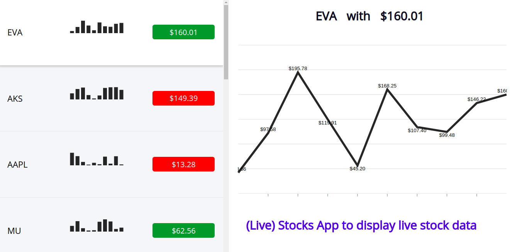

# LIVESTOCKS

A LiveStocks app with real-time stock data using react, redux

## About App

LiveStocks is an application, where a user can view stocks with real time values.

## Key Features

- Server Side Rendering (SSR) using NextJS and ReactJS
- State management with redux
- Styling with SASS
- Data visualization using Apexcharts

## Installation

- git clone https://github.com/HimanshuP90/Live-Stocks-App.git
- nvm use v12.3.1 or greater
- npm install
- npm run start
- open http://localhost:3000/ to see your live app
